# EllieSoft
Part of an enormous collection of iOS apps, written in _Phonegap_ (aka _Cordova_).

## Background

  
PhoneGap

_PhoneGap_ was the framework which became _Cordova_ after it was acquired by _Adobe_.  This is essentially a
web page (_NSWebView_ on _iOS_) running locally.  _PhoneGap_ provides additional functionality to access
hardware on the host platform eg camera, pictures, contacts, but none of these apps needed that.

The main attraction of _PhoneGap_ is that it provides a reasonable way to develop cross-platform apps.
The downside is that not all native functionality is available or accessible.  Further, any UI is
constrained by what is available in a web page.  However, for the types of apps I was developing at the time, 
this was an acceptable compromise.

These were written c2008-c2011 and probably do not show the best practices for Javascript as I was just
learning Javascript and fumbling my way through.  However, in my defence,  "Shipping code trumps everything"!

## Apps

### Guess That Picture 
_**Please note that the images are deliberately low quality to reduce the size of the repository**_

Can you see what it is now? Let your little one enjoy a fun, guessing game by rubbing the screen to reveal part of picture.  Help your child choose from some simple choices to earn points and unlock rewards.  If they get it right, they
can only reveal less of the next picture.

Once your child has earned enough points, let them go to the rewards section.  This features a range of cute animals and trains complete with sound effects for your child to play with.  Playing the game earns more points and allows access to more rewards.

'Guess That Picture' features:
  * simple, uncluttered, intuitive interface which is perfect for children
  * almost 1000 colorful images for endless entertainment
  * cute sound effects (which can be turned off!)
  * farmyard animal and train rewards with sounds

  
Screenshots

  
  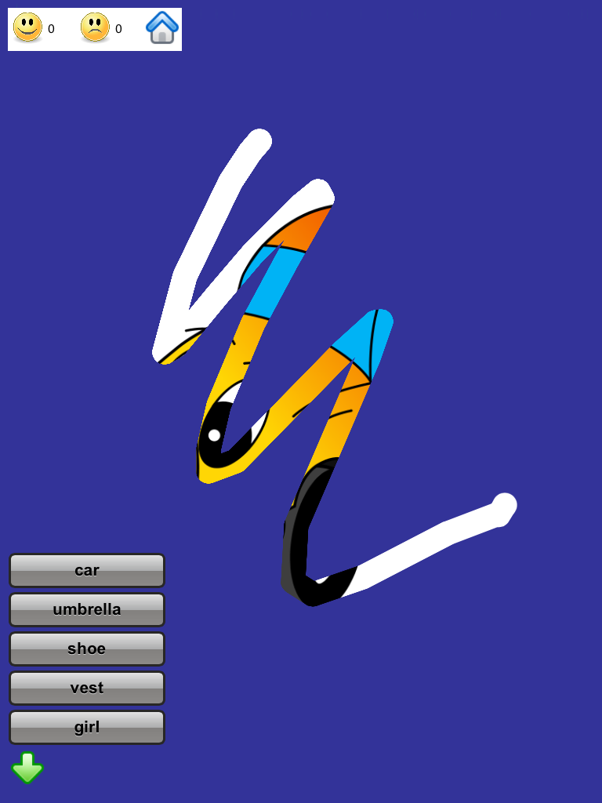

  

  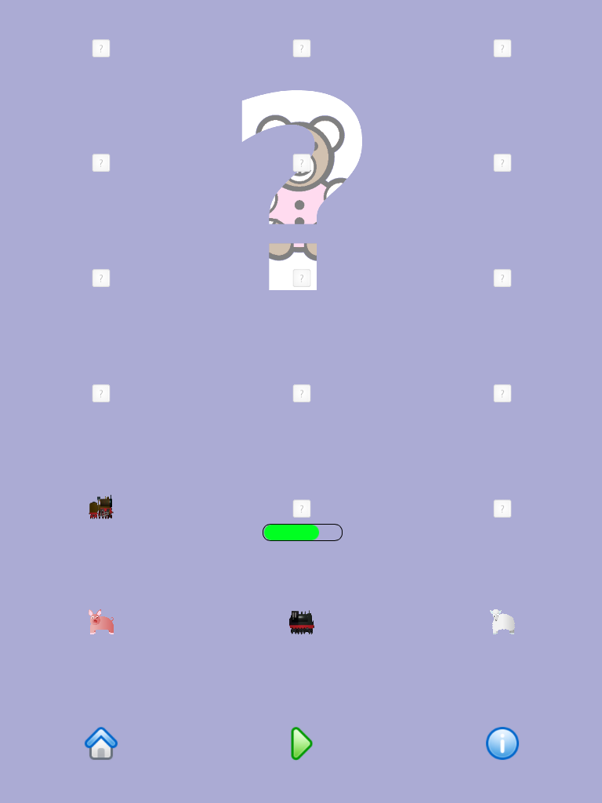

  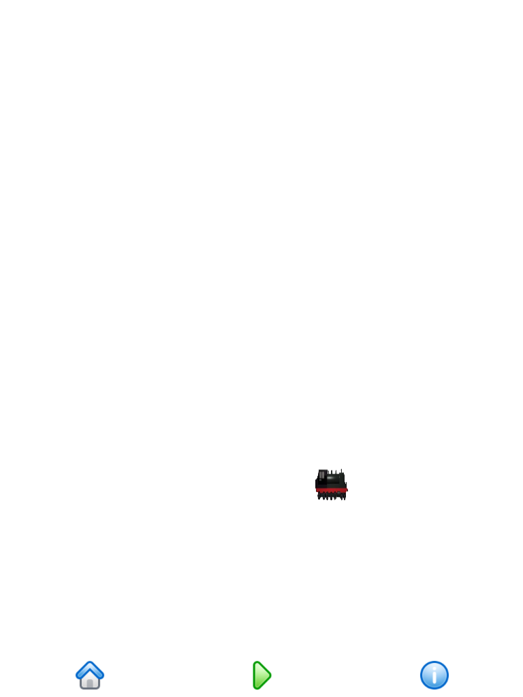

  

  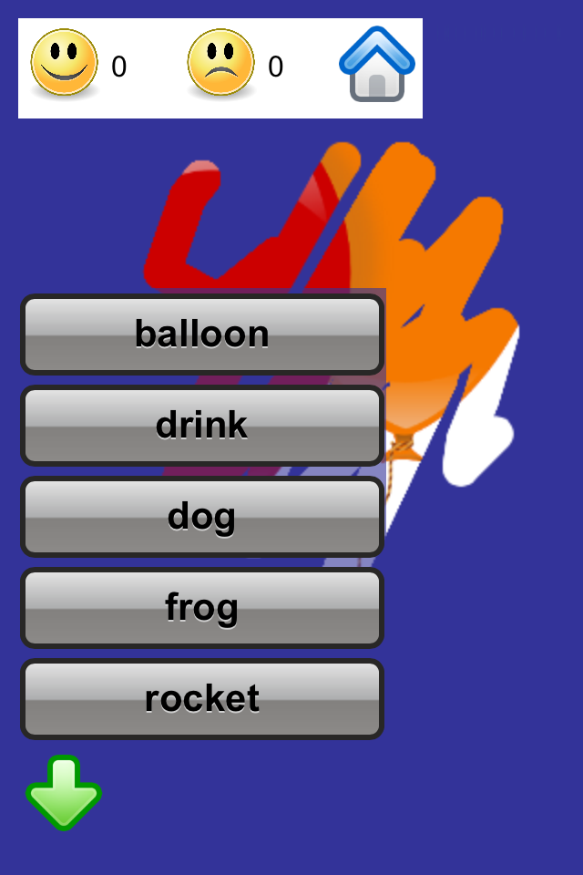

  

  

  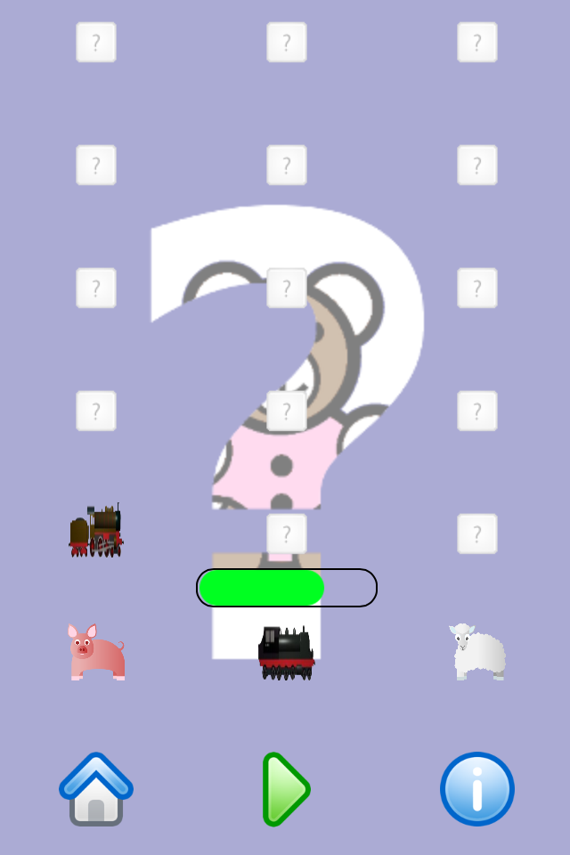

  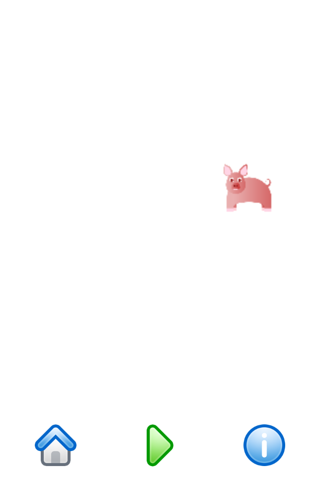

  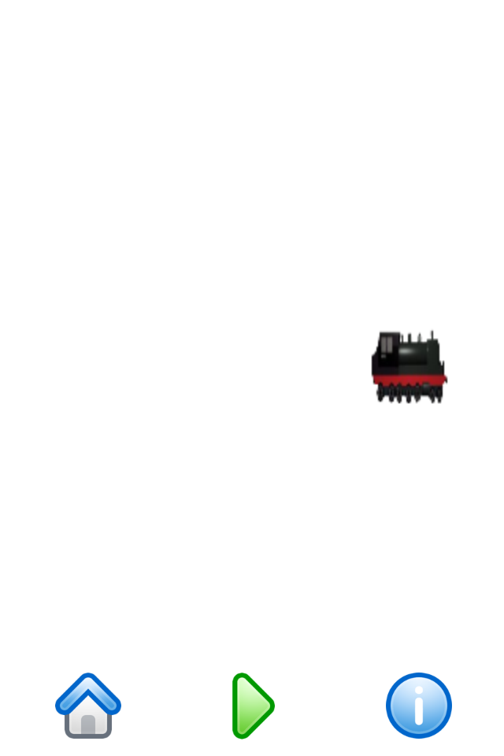

  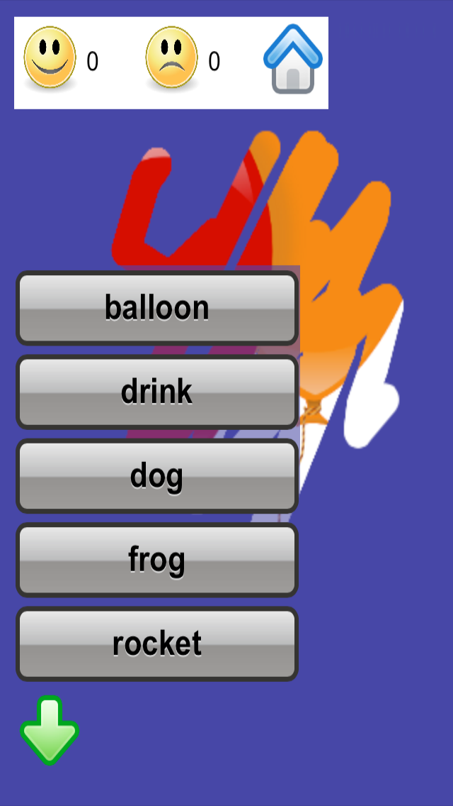

  

  

  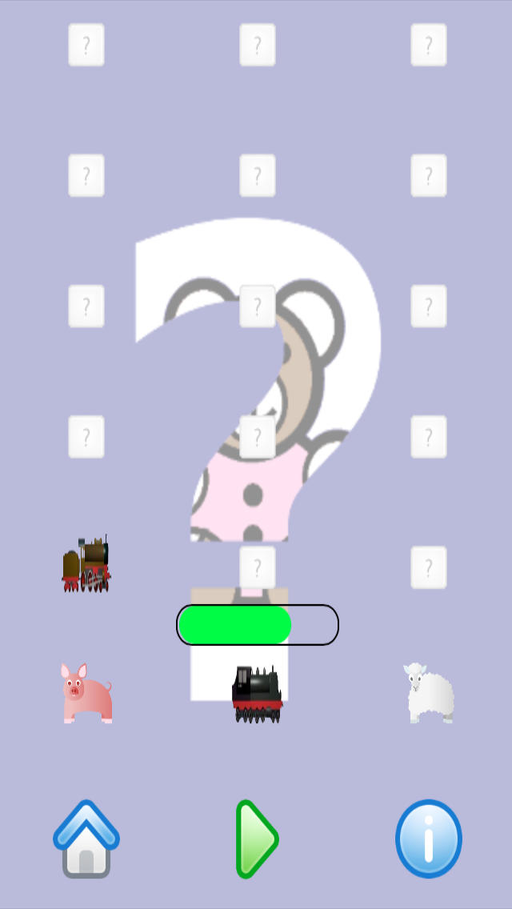

  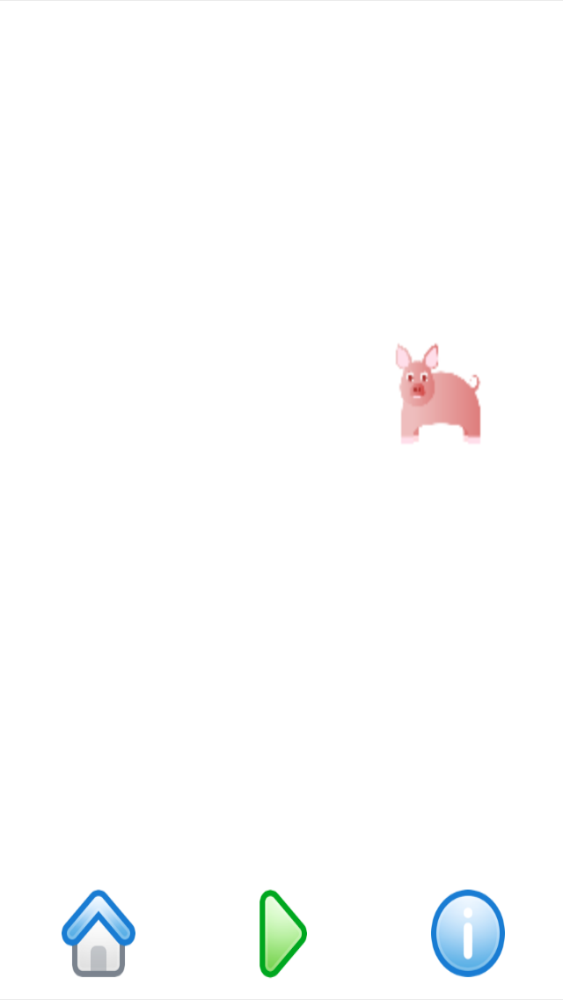

  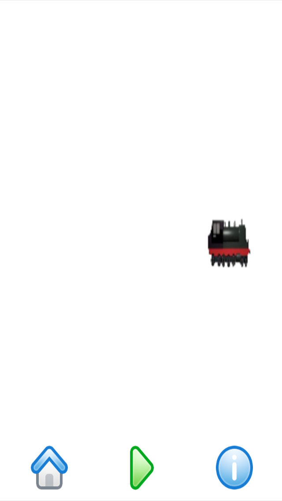

